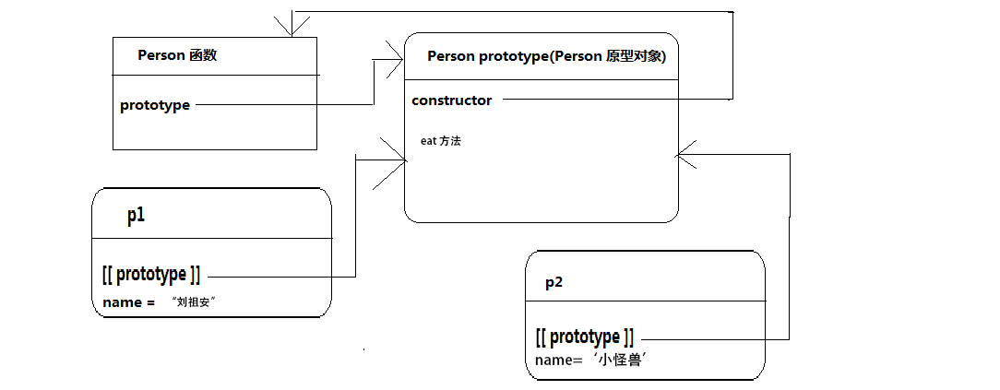
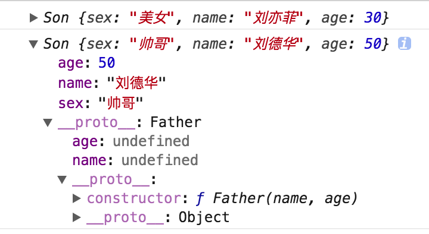

# <font color=#0099ff size=5 face="黑体">原型、原型链与继承</font>

### 一、原型
#### 1.1. 什么是原型
  在JavaScript中，我们创建一个函数A(就是声明一个函数), 那么浏览器就会在内存中创建一个对象B，而且每个函数都默认会有一个属性 prototype 指向了这个对象( 即：prototype的属性的值是这个对象 )。这个对象B就是函数A的原型对象，简称函数的原型。这个原型对象B 默认会有一个属性 constructor 指向了这个函数A ( 意思就是说：constructor属性的值是函数A )。
  
  动态原型模式创建对象:
  
```
function Person(name, age) { // Person构造函数
  this.name = name
  this.age = age
  if (typeof this.eat !== 'function') {
    Point.prototype.eat = function (food) {
      alert(this.age + '岁的' + this.name + '在吃' + food)
    };
  }
}
let p1 = new Point('刘祖安', 25) // 实例1
let p2 = new Point('小怪兽', 3) // 实例2
p1.eat('橘子')
p2.eat('苹果')
```
#### 1.2. 与原型有关的几个属性和方法
  1. prototype属性

  prototype 存在于构造函数中 (其实任意函数中都有，只是不是构造函数的时候prototype我们不关注而已) ，他指向了这个构造函数的原型对象。

  2. constructor属性

  ​ constructor属性存在于原型对象中，他指向了构造函数

  3. `__proto__` 属性

  用构造方法创建一个新的对象之后，这个对象中默认会有一个不可访问的属性 [[prototype]] , 这个属性就指向了构造方法的原型对象。
​  但是在个别浏览器中，也提供了对这个属性[[prototype]]的访问(chrome浏览器和火狐浏览器。ie浏览器不支持)。访问方式：p1.`__proto__`
  4. hasOwnProperty() 方法

  hasOwnProperty方法，可以判断一个属性是否来自对象本身。

  5.  in 操作符

  ​ in操作符用来判断一个属性是否存在于这个对象中。但是在查找这个属性时候，现在对象本身中找，如果对象找不到再去原型中找。换句话说，只要对象和原型中有一个地方存在这个属性，就返回true。

### 二、原型链与继承

* 在JavaScript中，将原型链作为实现继承的主要方法。其基本思想是利用原型让一个引用类型继承另一个引用类型的属性和方法

#### 2.1. 父类型的属性共享问题

  在原型链中，父类型的构造函数创建的对象，会成为子类型的原型。那么父类型中定义的实例属性，就会成为子类型的原型属性。对子类型来说，这和我们以前说的在原型中定义方法，构造函数中定义属性是违背的。子类型原型(父类型对象)中的属性被所有的子类型的实例所共有，如果有个一个实例去更改，则会很快反应的其他的实例上。

```
function Father () {
  this.girls = ["志玲", "凤姐"];
}
function Son () {

}
// 子类的原型对象中就有一个属性 girls ，是个数组
Son.prototype = new Father();   
var son1 = new Son();
var son2 = new Son();
//给son1的girls属性的数组添加一个元素
son1.girls.push("亦非");
//这时，发现son2中的girls属性的数组内容也发生了改变
alert(son2.girls);  // "志玲", "凤姐", "亦非"
```
#### 2.2. 向父类型的构造函数中传递参数问题
 
  ​在原型链的继承过程中，只有一个地方用到了父类型的构造函数，Son.prototype = new Father();。只能在这个一个位置传递参数，但是这个时候传递的参数，将来对子类型的所有的实例都有效。

​  如果想在创建子类型对象的时候传递参数是没有办法做到的。

​  如果想创建子类对象的时候，传递参数，只能另辟他法。

#### 2.3. 借用构造函数调用”继承”

  ​ 使用 call 或 apply 这两个方法完成函数借调。这两个方法的功能是一样的，只有少许的区别(暂且不管)。功能都是更改一个构造方法内部的 this 指向到指定的对象上。

```
function Father(name, age) {
  this.name = name;
  this.age = age;
}
function Son(name, age, sex) {
  this.sex = sex;
  Father.call(this, name, age);
}
Son.prototype = new Father();
var son1 = new Son('刘亦菲', 30, '美女');
var son2 = new Son('刘德华', 50, '帅哥');
console.log(son1);
console.log(son2);
```



  
